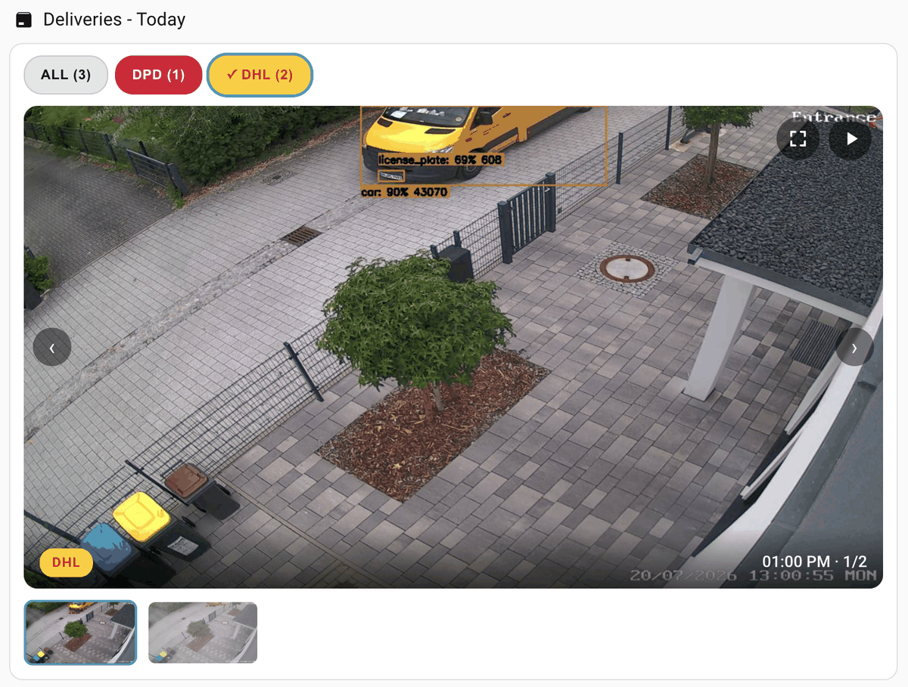

# Frigate Delivery Card

[](https://github.com/hacs/integration)
[](LICENSE)


A lightweight Home Assistant Lovelace card that shows **Frigate event snapshots filtered by `sub_label`** — the one filter the popular camera cards don't support yet.

Built for the classic use case: a **Frigate+ model recognizes delivery company logos** (DHL, DPD, GLS, UPS, Amazon, …) and assigns them as sub_labels to tracked vehicles. This card turns those events into a clean, browsable snapshot reel on your dashboard — *"which delivery vans came by in the last 24 hours?"* — with zero extra plumbing: no snapshot automations, no folders, no cleanup jobs.

<!-- Add a screenshot: docs/screenshot.png -->
<!--  -->

## Features

- **Sub_label filtering** — show only events with specific sub_labels (delivery companies, recognized faces, license plates)
- **Two views** — `reel` (slideshow + thumbnail strip) and `timeline` (brand-colored time pills above the slideshow)
- **Brand-colored badges** for known couriers (DHL, DPD, GLS, UPS, Amazon, Hermes, FedEx) on captions, chips, rows and timeline pills
- **Sort order** — newest first (default) or oldest first
- **Clip playback** — a &#9654; button on the image plays the event's recorded clip in the lightbox (requires `record:` enabled in Frigate; hide with `clips: false`)
- **Visual editor** — full UI configuration in the dashboard card editor, no YAML required
- **Auto-advancing slideshow** with configurable interval, pauses on hover
- **Filter chips** per company/sub_label with live event counts
- **Thumbnail strip** for quick scrubbing, arrow navigation, keyboard-free touch operation
- **Fullscreen lightbox** on tap
- **Time-range based** — rolling window (e.g. last 24 h) or **today only** (since local midnight); retention is handled entirely by your Frigate `snapshots: retain:` settings
- **Auto-refresh** (default every 2 minutes)
- Also filters by `labels` and `zones`, so it doubles as e.g. a *"person at the mailbox"* card
- Theme-aware styling, no external dependencies, ~8 KB

## How it works

The card talks to the [Frigate Home Assistant integration](https://github.com/blakeblackshear/frigate-hass-integration)'s websocket API (`frigate/events/get`), which natively supports `sub_labels` filtering. Snapshots are served through the integration's built-in proxy. Everything stays inside Home Assistant — the browser never talks to the Frigate server directly.

## Requirements

- [Frigate](https://frigate.video) with snapshots enabled for the relevant camera
- The [Frigate Home Assistant integration](https://github.com/blakeblackshear/frigate-hass-integration) (v5+)
- For delivery company recognition: a [Frigate+](https://frigate.video/plus/) model that assigns company sub_labels, with the labels listed under `objects: track:` in your Frigate config
- For clip playback: `record:` enabled in Frigate (event/alert retention is enough)

## Installation

### HACS (recommended)

1. Open **HACS** in Home Assistant
2. Click the three-dot menu → **Custom repositories**
3. Add `https://github.com/thomasgregg/frigate-delivery-card` with category **Dashboard**
4. Search for **Frigate Delivery Card** and download it
5. Reload your browser (HACS registers the resource automatically)

### Manual

1. Download `frigate-delivery-card.js` from the [latest release](https://github.com/thomasgregg/frigate-delivery-card/releases)
2. Copy it to `/config/www/frigate-delivery-card.js`
3. Add a dashboard resource: **Settings → Dashboards → ⋮ → Resources → Add**, URL `/local/frigate-delivery-card.js`, type **JavaScript module**

## Configuration

| Option | Type | Default | Description |
|---|---|---|---|
| `type` | string | **required** | `custom:frigate-delivery-card` |
| `camera` | string | **required*** | Frigate camera name (as in your Frigate config) |
| `cameras` | list | – | Multiple Frigate camera names (*alternative to `camera`) |
| `sub_labels` | list | `[dhl, dpd, gls, ups, amazon]` | Sub_labels to show. Set `[]` to disable sub_label filtering |
| `labels` | list | – | Optional label filter, e.g. `[person]` |
| `zones` | list | – | Optional zone filter, e.g. `[mailbox]` |
| `view` | string | `reel` | `reel` or `timeline` |
| `sort` | string | `newest` | Event order: `newest` or `oldest` first |
| `clips` | boolean | `true` | Show the &#9654; clip-playback button on the image (requires Frigate `record:` enabled) |
| `period` | string | `hours` | Time range: `hours` (rolling look-back window) or `today` (since local midnight) |
| `hours` | number | `24` | Look-back window in hours (only used when `period: hours`) |
| `limit` | number | `100` | Maximum events to fetch |
| `slideshow` | number | `6` | Auto-advance interval in seconds, `0` to disable |
| `refresh` | number | `120` | Refetch interval in seconds |
| `instance_id` | string | `frigate` | Frigate instance / client id (only needed for multi-instance setups) |

### Examples

**Delivery reel — last 24 h:**

```yaml
type: custom:frigate-delivery-card
camera: entrance
sub_labels:
  - dhl
  - dpd
  - gls
  - ups
  - amazon
hours: 24
```

**Timeline — brand-colored time pills, no filter chips:**

```yaml
type: custom:frigate-delivery-card
camera: entrance
view: timeline
period: today
```

**Deliveries today only (resets at local midnight):**

```yaml
type: custom:frigate-delivery-card
camera: entrance
sub_labels:
  - dhl
  - dpd
  - gls
  - ups
  - amazon
period: today
```

**Who was at the mailbox (zone + label instead of sub_label):**

```yaml
type: custom:frigate-delivery-card
camera: entrance
sub_labels: []
labels:
  - person
zones:
  - mailbox
hours: 48
slideshow: 0
```

**Recognized license plates across two cameras:**

```yaml
type: custom:frigate-delivery-card
cameras:
  - entrance
  - carport
sub_labels:
  - Flitzer
  - Volvo
hours: 72
```

## Troubleshooting

- **"No matching events"** — check that snapshots are enabled for the camera in Frigate and that events in the window actually carry the sub_label (Frigate UI → Explore → filter by sub label).
- **Card doesn't load / unknown card type** — hard-refresh the browser (Ctrl+Shift+R) after installation.
- **"Unable to find Frigate instance"** — set `instance_id` to your Frigate client id (only relevant with multiple Frigate instances).
- **Sub_labels are case-sensitive as stored by Frigate** — the card lowercases companies for chips, but the query filter must match what Frigate stores (Frigate+ logo labels are lowercase).

## Credits

Inspired by the sub_label filtering gap in the excellent [Advanced Camera Card](https://github.com/dermotduffy/advanced-camera-card) ([issue #2255](https://github.com/dermotduffy/advanced-camera-card/issues/2255)). Built on the [Frigate HA integration](https://github.com/blakeblackshear/frigate-hass-integration) websocket API.

## License

[MIT](LICENSE)
